# EngineeringTeam Crew

A sophisticated multi-agent AI system powered by [crewAI](https://crewai.com) that simulates a complete engineering team workflow. This project leverages specialized AI agents to collaborate on complex software development tasks, from frontend development to backend implementation and testing.

## 🚀 Overview

The EngineeringTeam Crew consists of specialized AI agents that work together to:
- **Plan and architect** software solutions
- **Develop frontend interfaces** with Gradio
- **Build robust backend APIs** and servers
- **Execute comprehensive testing** strategies
- **Deploy applications** in containerized environments

## 🏗️ Architecture

```mermaid
graph TD
    A[👤 User Input] --> B[🎯 Engineering Lead Agent]
    
    B --> C[🔄 Sequential Multi-Agent Chain]
    
    C --> D[⚛️ Frontend Agent]
    C --> E[🔧 Backend Agent]
    C --> F[🧪 Tester Agent]
    
    D --> D1[📱 Generates Gradio Code]
    E --> E1[🔌 Builds API/Server]
    F --> F1[✅ Runs Tests]
    
    D1 --> G[🐳 Docker Environment]
    E1 --> G
    F1 --> G
    
    G --> H[🚀 Executed App]
    
    H --> I[📊 Gradio UI]
```



## 🛠️ Tech Stack

- **Python 3.10-3.12** - Core language
- **[crewAI](https://crewai.com)** - Multi-agent framework
- **[UV](https://docs.astral.sh/uv/)** - Fast dependency management
- **OpenAI GPT** - Agent intelligence
- **Gradio** - Frontend UI generation
- **Docker** - Containerization

## 📋 Prerequisites

- Python >= 3.10 and < 3.13
- OpenAI API key
- UV package manager
- Docker (optional, for containerized deployment)

## 🚀 Quick Start

### 1. Install UV Package Manager

```bash
pip install uv
```

### 2. Clone and Setup

```bash
git clone <your-repo-url>
cd engineering-team-crew
```

### 3. Install Dependencies

```bash
crewai install
```

### 4. Configure Environment

Create a `.env` file in the root directory:

```env
OPENAI_API_KEY=your_openai_api_key_here
```

### 5. Run the Crew

```bash
crewai run
```

## ⚙️ Configuration

### Agent Configuration

Modify `src/engineering_team/config/agents.yaml` to customize your AI agents:

```yaml
engineering_lead:
  role: "Engineering Lead"
  goal: "Coordinate and oversee the development process"
  backstory: "Experienced technical leader with expertise in project management"

frontend_developer:
  role: "Frontend Developer"
  goal: "Create intuitive and responsive user interfaces"
  backstory: "UI/UX focused developer specializing in Gradio applications"

backend_developer:
  role: "Backend Developer"
  goal: "Build scalable APIs and server infrastructure"
  backstory: "Backend specialist with expertise in API design and architecture"

tester:
  role: "QA Tester"
  goal: "Ensure code quality and functionality"
  backstory: "Detail-oriented tester focused on comprehensive quality assurance"
```

### Task Configuration

Modify `src/engineering_team/config/tasks.yaml` to define your workflow:

```yaml
plan_architecture:
  description: "Analyze requirements and create technical architecture"
  agent: engineering_lead
  
develop_frontend:
  description: "Create Gradio-based user interface"
  agent: frontend_developer
  
build_backend:
  description: "Implement API and server logic"
  agent: backend_developer
  
run_tests:
  description: "Execute comprehensive testing suite"
  agent: tester
```

## 🔧 Customization

### Adding Custom Logic

Edit `src/engineering_team/crew.py` to:
- Add custom tools and integrations
- Modify agent behaviors
- Configure specific arguments
- Implement custom workflows

### Custom Inputs

Modify `src/engineering_team/main.py` to:
- Add custom input parameters
- Configure agent interactions
- Set up custom task flows

## 📁 Project Structure

```
engineering-team-crew/
├── src/
│   └── engineering_team/
│       ├── config/
│       │   ├── agents.yaml      # Agent definitions
│       │   └── tasks.yaml       # Task configurations
│       ├── crew.py             # Main crew logic
│       └── main.py             # Entry point
├── .env                        # Environment variables
├── pyproject.toml             # Project dependencies
└── README.md                  # This file
```

## 🎯 Use Cases

- **Rapid Prototyping**: Quickly generate functional applications
- **Code Generation**: Automated frontend and backend development
- **Testing Automation**: Comprehensive test suite generation
- **Educational Projects**: Learn multi-agent AI collaboration
- **MVP Development**: Fast minimum viable product creation

## 🔄 Workflow Example

1. **Input**: "Create a data visualization dashboard"
2. **Planning**: Engineering Lead analyzes requirements
3. **Frontend**: Gradio interface with charts and controls
4. **Backend**: API endpoints for data processing
5. **Testing**: Automated test suite validation
6. **Deployment**: Containerized application ready to run

## 🐛 Troubleshooting

### Common Issues

**Installation Problems**:
```bash
# If UV installation fails
pip install --upgrade pip
pip install uv

# If crewai install fails
uv sync
```

**API Key Issues**:
- Ensure `.env` file is in the root directory
- Verify OpenAI API key is valid and has credits
- Check environment variable loading

**Agent Errors**:
- Review agent configurations in `agents.yaml`
- Check task dependencies in `tasks.yaml`
- Verify custom logic in `crew.py`

## 🤝 Contributing

1. Fork the repository
2. Create a feature branch (`git checkout -b feature/amazing-feature`)
3. Commit your changes (`git commit -m 'Add some amazing feature'`)
4. Push to the branch (`git push origin feature/amazing-feature`)
5. Open a Pull Request

## 📚 Resources

- **[crewAI Documentation](https://docs.crewai.com)** - Official framework docs
- **[GitHub Repository](https://github.com/joaomdmoura/crewai)** - Source code and issues
- **[Discord Community](https://discord.com/invite/X4JWnZnxPb)** - Chat with other developers
- **[Interactive Docs](https://chatg.pt/DWjSBZn)** - AI-powered documentation chat

## 📄 License

This project is licensed under the MIT License - see the [LICENSE](LICENSE) file for details.

## 🌟 Acknowledgments

- Built with [crewAI](https://crewai.com) - The multi-agent AI framework
- Powered by OpenAI GPT models
- UI generation via Gradio
- Dependency management by UV

---
